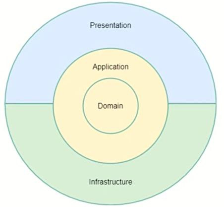

<h1>Refbooks</h1>
<h3>Описание проекта:</h3>

> * API для получение и обновления из XML справочной информации для фронта на React
> * Можно обратить внимание на эндпоинт обновления справочников api/refbooks/update (кастомный маппер - <em>Refbooks.Persistence.Updater</em>)
> * Кастомный model builder для EF - <em>Refbooks.Persistence.EntityTypeConfigurationExtensions</em>
> * RefbooksDbMigrationHostedService - <em>Refbooks.Persistence</em>
> * CacheProfiles от AspNetCore (<em>Program.cs - line: 16</em>)
> * Refbooks.WebAPI.Middleware - FactoryCustomExceptionHandlerMiddleware - для обратоки исключений со сбросом кэша при ошибках
> * Используются: EFCore, Migrations, EFCore NamingConventions, MediatR, CQRS, Swagger

<h4>Для запуска проекта необходимо указать строку подключения к БД DefaultConnectionString в <em>Refbooks.WebAPI\appsettings.json</em></h4>

<h3>Структура проекта:</h3>

> ## \Domain -  Core 
> * Модели базы данных
>

> ## \Application -  Core 
> * Интерфейсы
> * CQRS-файлы: команды, запросы и их обработчики
> * Исключения
>

> ## \Persistence -  Infrastructure 
> * Контекст базы данных
> * Миграции
> * Конфигурации контекста
> * Обновлятор справочников
> * Конфигурации обновления справочников

> ## \WebApi -  Presentation 
> * ASP .Net WebAPI приложение
>

<h3>Схема:</h3>

